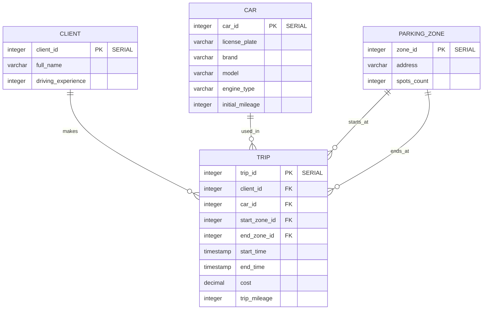
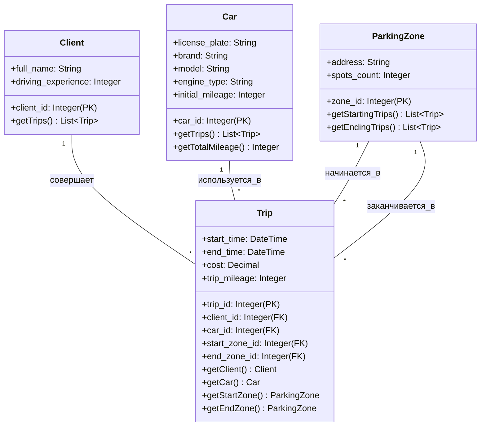
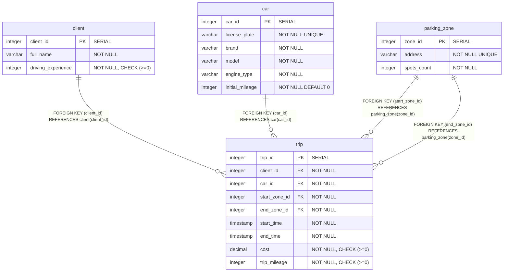

**Лабораторные работы по БД**

Перечень [лабораторных работ](https://edu.irnok.net/doku.php?id=db:main#%D0%BB%D0%B0%D0%B1%D0%BE%D1%80%D0%B0%D1%82%D0%BE%D1%80%D0%BD%D0%B0%D1%8F_%D1%80%D0%B0%D0%B1%D0%BE%D1%82%D0%B0_5_%D1%82%D1%80%D0%B8%D0%B3%D0%B3%D0%B5%D1%80%D1%8B)

Telegram: [at]kilf3

# Постановка задачи (вариант 32)

**Учет контактов и взаимодействий (личная CRM)**

*Сущности:* Автомобили (гос. номер, марка, модель, тип двигателя, пробег), зоны парковки (адрес, количество мест), клиенты (ID, ФИО, водительский стаж).

*Процессы:*  Клиенты арендуют автомобили на определенные промежутки времени, поездки начинаются и заканчиваются в зонах парковки.

*Выходные документы:*
  - Выдать список самых популярных зон парковки для начала поездок за указанный период, отсортированный по количеству поездок.
  - Для заданного клиента выдать историю всех поездок с указанием стоимости и пробега, отсортированную по дате поездки.

# Лабораторная работа 1 (Проектирование логической и физической модели БД)

## Промпт к DeepSeek

```text
Лаба по проектированию информационной модели для реляционных баз данных.
Предполагаем Postgresql. 
Есть ошибки, замечания, неточности?

# Система каршеринга (аренды автомобилей по минутам)

## Постановка задачи

*Сущности:*
    Автомобили (гос_номер, марка, модель, тип_двигателя, пробег),
    Зоны_парковки (адрес, количество_мест),
    Клиенты (ID, ФИО, водительский_стаж).

*Процессы:*
    Клиенты арендуют автомобили на определенные промежутки времени,
    поездки начинаются и заканчиваются в зонах парковки.

*Выходные документы:*

  - Выдать список самых популярных зон парковки для начала поездок за указанный период, отсортированный по количеству поездок.

  - Для заданного клиента выдать историю всех поездок с указанием стоимости и пробега, отсортированную по дате поездки.

## ER-Модель

### Базовые сущности

    Автомобиль(гос_номер, марка, модель, тип_двигателя, пробег)
    ЗонаПарковки(адрес, количество_мест)
    Клиент(ФИО, водительский_стаж)

### Отношения

    [Клиент]-N,Optional------------------1,Required-[Поездка]-N,Required------------------1,Required-[Автомобиль]

    [ЗонаПарковки]-1,Optional------------------N,Required-[Поездка] (начало)
    [ЗонаПарковки]-1,Optional------------------N,Required-[Поездка] (окончание)

## Логическая модель

Получаем четыре таблицы:

  - ```Car(license_plate, brand, model, engine_type, mileage)```, primary key - license_plate
  - ```ParkingZone(address, spots_count)```, primary key - address
  - ```Client(client_id, full_name, driving_experience)```, primary key - client_id
  - ```Trip(trip_id, client_id, car_license_plate, start_zone_address, end_zone_address, start_time, end_time, cost, trip_mileage)```, primary key - trip_id

## Физическая модель

Зададим типы данных для атрибутов:

  - ```license_plate::varchar(10)```
  - ```brand::varchar(50)```
  - ```model::varchar(50)```
  - ```engine_type::varchar(20)```
  - ```mileage::integer```
  - ```address::varchar(200)```
  - ```spots_count::integer```
  - ```client_id::integer```
  - ```full_name::varchar(100)```
  - ```driving_experience::integer```
  - ```trip_id::integer```
  - ```start_zone_address::varchar(200)```
  - ```end_zone_address::varchar(200)```
  - ```start_time::timestamp```
  - ```end_time::timestamp```
  - ```cost::decimal(10,2)```
  - ```trip_mileage::integer```
```

## Ответ DeepSeek

Отличная основа! Модель логична и отражает основные бизнес-процессы, но есть несколько важных улучшений для создания более надежной базы данных.

### Критические замечания и рекомендации

#### 1. Выбор первичных ключей
**Проблема:** Использование естественных ключей (`license_plate`, `address`) как первичных — рискованно.
*   **Изменяемость:** Госномер автомобиля или адрес зоны парковки могут измениться.
*   **Сложность:** Длинные строковые ключи неэффективны для соединений и индексов.

**Исправление:** Используем суррогатные ключи:
```sql
Car(car_id, license_plate, brand, model, engine_type, mileage)
ParkingZone(zone_id, address, spots_count)
```

#### 2. Отслеживание пробега автомобиля
**Проблема:** Пробег в `Car` будет постоянно устаревать.
**Решение:** Хранить начальный пробег в `Car`, а общий пробег вычислять как сумму начального пробега и всех поездок.

#### 3. Валидация данных поездки
**Проблема:** Нет проверки, что время окончания позже времени начала.
**Решение:** Добавить CHECK-ограничение или валидацию на уровне приложения.

#### 4. Отсутствие индексов для частых запросов

### Исправленная и улучшенная модель

#### Логическая модель
*   **`Car`** (`car_id`, license_plate, brand, model, engine_type, initial_mileage)
*   **`ParkingZone`** (`zone_id`, address, spots_count)
*   **`Client`** (`client_id`, full_name, driving_experience)
*   **`Trip`** (`trip_id`, `client_id`, `car_id`, `start_zone_id`, `end_zone_id`, start_time, end_time, cost, trip_mileage)

#### Физическая модель (DDL для PostgreSQL)
```sql
CREATE TABLE Car (
    car_id SERIAL PRIMARY KEY,
    license_plate VARCHAR(10) NOT NULL UNIQUE,
    brand VARCHAR(50) NOT NULL,
    model VARCHAR(50) NOT NULL,
    engine_type VARCHAR(20) NOT NULL,
    initial_mileage INTEGER NOT NULL DEFAULT 0
);

CREATE TABLE ParkingZone (
    zone_id SERIAL PRIMARY KEY,
    address VARCHAR(200) NOT NULL UNIQUE,
    spots_count INTEGER NOT NULL
);

CREATE TABLE Client (
    client_id SERIAL PRIMARY KEY,
    full_name VARCHAR(100) NOT NULL,
    driving_experience INTEGER NOT NULL CHECK (driving_experience >= 0)
);

CREATE TABLE Trip (
    trip_id SERIAL PRIMARY KEY,
    client_id INTEGER NOT NULL REFERENCES Client(client_id) ON DELETE RESTRICT,
    car_id INTEGER NOT NULL REFERENCES Car(car_id) ON DELETE RESTRICT,
    start_zone_id INTEGER NOT NULL REFERENCES ParkingZone(zone_id) ON DELETE RESTRICT,
    end_zone_id INTEGER NOT NULL REFERENCES ParkingZone(zone_id) ON DELETE RESTRICT,
    start_time TIMESTAMP NOT NULL,
    end_time TIMESTAMP NOT NULL,
    cost DECIMAL(10,2) NOT NULL CHECK (cost >= 0),
    trip_mileage INTEGER NOT NULL CHECK (trip_mileage >= 0),
    CHECK (end_time > start_time)
);

-- Индексы для ускорения часто используемых запросов
CREATE INDEX idx_trip_start_time ON Trip(start_time);
CREATE INDEX idx_trip_client_dates ON Trip(client_id, start_time);
CREATE INDEX idx_trip_start_zone_time ON Trip(start_zone_id, start_time);
```

#### Проверка нормальных форм
*   **1NF:** Соблюдена - все значения атомарные
*   **2NF:** Соблюдена - нет зависимостей неключевых атрибутов от части ключа
*   **3NF/BCNF:** Соблюдена - нет транзитивных зависимостей

---

### Примеры запросов для "Выходных документов"

**1. Самые популярные зоны парковки для начала поездок за период:**
```sql
SELECT 
    pz.address,
    COUNT(t.trip_id) as trip_count
FROM Trip t
JOIN ParkingZone pz ON t.start_zone_id = pz.zone_id
WHERE t.start_time BETWEEN '2024-01-01' AND '2024-12-31'
GROUP BY pz.zone_id, pz.address
ORDER BY trip_count DESC;
```

**2. История поездок для заданного клиента:**
```sql
SELECT 
    t.start_time,
    t.end_time,
    c.license_plate,
    c.brand,
    c.model,
    start_zone.address as start_address,
    end_zone.address as end_address,
    t.trip_mileage,
    t.cost
FROM Trip t
JOIN Car c ON t.car_id = c.car_id
JOIN ParkingZone start_zone ON t.start_zone_id = start_zone.zone_id
JOIN ParkingZone end_zone ON t.end_zone_id = end_zone.zone_id
WHERE t.client_id = 1  -- Подставьте нужный client_id
ORDER BY t.start_time DESC;
```

**Дополнительный полезный запрос - общий пробег автомобиля:**
```sql
SELECT 
    car_id,
    license_plate,
    initial_mileage + COALESCE(SUM(trip_mileage), 0) as total_mileage
FROM Car
LEFT JOIN Trip USING (car_id)
GROUP BY car_id, license_plate, initial_mileage;
```

## Полученные диаграммы:

### ER-диаграмма



## Логическая модель в виде Диаграммы классов UML



## Физическая модель БД



## Заключение

В лабораторной работе произведено проектирование ER-, логической и физической модели базы данных для системы каршеринга (вариант 32). Основные улучшения, внесенные в ходе проектирования:

1. **Суррогатные ключи** - заменены естественные ключи (госномер, адрес) на суррогатные идентификаторы для стабильности структуры
2. **Управление пробегом** - разделен начальный пробег автомобиля и пробег поездок для точного отслеживания
3. **Валидация данных** - добавлены CHECK-ограничения для стажа вождения, стоимости, пробега и временных интервалов
4. **Оптимизация производительности** - созданы индексы для частых запросов по датам и клиентам
5. **Нормализация** - модель соответствует требованиям 3NF/BCNF

Модель эффективно поддерживает все требуемые бизнес-процессы и выходные документы, обеспечивая надежное хранение данных и высокую производительность запросов.
